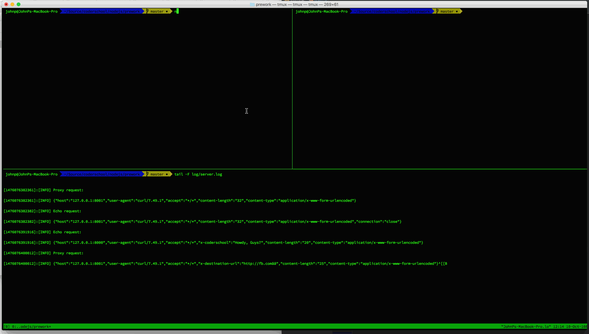

# Proxy Server

This is a Proxy Server for Node.js submitted as the [pre-work](http://courses.codepath.com/snippets/intro_to_nodejs/prework) requirement for CodePath.

Time spent: 2 hours

Completed:

* [x] Required: Requests to port `8000` are echoed back with the same HTTP headers and body
* [x] Required: Requests/reponses are proxied to/from the destination server
* [x] Required: The destination server is configurable via the `--host`, `--port`  or `--url` arguments
* [x] Required: The destination server is configurable via the `x-destination-url` header
* [x] Required: Client requests and respones are printed to stdout
* [x] Required: The `--logfile` argument outputs all logs to the file specified instead of stdout

Walkthrough Gif:



Note: to embed the gif file, just check your gif file into your repo and update the name of the file above.

## Starting the Server

```
npm start
```

## Features

### Echo Server:

```bash
curl -v POST http://127.0.0.1:8000/coderschool -d "Hello Coderschool - " -H "x-coderschool: Howdy, Guys?"
```

### Proxy Server:

Port 8001 will proxy to the echo server on port 8000.

```bash
curl -v http://127.0.0.1:8001/coderschool -d "Hello Coderschool - Proxy Server"
```

### Configuration:

#### CLI Arguments:

The following CLI arguments are supported:

##### `--host`

The host of the destination server. Defaults to `127.0.0.1`.

##### `--port`

The port of the destination server. Defaults to `80` or `8000` when a host is not specified.

##### `--url`

A single url that overrides the above. E.g., `http://www.google.com`

##### `--logfile`

Specify a file path to redirect logging to.

#### Headers

The follow http header(s) are supported:

##### `x-destination-url`

Specify the destination url on a per request basis. Overrides and follows the same format as the `--url` argument.
